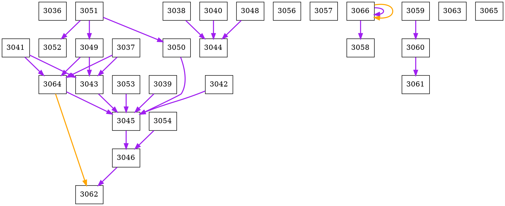

# Desafio Hackathon Hiperstream 2024 - Mackenzie

# Equipe

Nome: Dream Team Include
Código: HIPER-155

## Tópicos

- [Historia](#história)
    - [Modelo de Dados](#modelo-de-dados)
    - [Exemplo de Dados](#exemplo-de-dados)
- [Como Executar o Programa](#como-executar-o-programa)
    - [Pré-requisitos](#pré-requisitos)
    - [Modo de Execução para Diferentes Sisemas Operacionais](#modo-de-execução-para-diferentes-sistemas-operacionais)
- [Solução Desenvolvida](#solução-desenvolvida)
- [Fundamentando as Decisões](#fundamentando-as-decisoes)
    - [Linguagem de Programação: Java](#linguagem-de-programação-java)
    - [Biblioteca de Visualização: Graphviz](#biblioteca-de-visualização-graphviz)
    - [Estrutura de Dados: Grafos](#estrutura-de-dados-grafos)
- [Resultados](#resultados)
    - [Arquivo.dot](#arquivo.dot)
    - [Arquivo saida.txt](#arquivo-saida.txt)
    - [Imagem](#imagem-png-como-diagrama)
- [Explicando o Código](#explicando-o-código)
    - [Classe Main](#classe-main)
        - [readFile()](#readfile)
        - [Processamento do CSV](#processamento-do-csv)
        - [Processamento das Linhas](#processamento-das-linhas)
        - [Conexão entre os Nós](#conexão-entre-os-nós)
        - [Impressão dos Nós](#impressão-dos-nós)
        - [Mensagem de Erro](#mensagem-de-erro)
    - [Classe Node](#classe-node)
        - [Atributos da Classe](#atributos-da-classe)
        - [Construtores da Classe](#construtores-da-classe)
        - [Getters e Setters](#getters-e-setters)
        - [Adicionando Conexões](#adicionando-conexões)
        - [Obtendo as Listas de Conexões](#obtendo-as-listas-de-conexões)
        - [Método toString()](#método-tostring)
    - [Classe Graph](#classe-graph)
    - [Classe GraphPrinter](#classe-graphprinter)
        - [Adição de Linhas no Arquivo](#adição-de-linhas-no-arquivo)
        - [Criação do Arquivo](#criação-do-arquivo)


# História

Eu enquanto Colaborador H Hiperstream, necessito de um sistema que com base no modelo de dados sugerido seja capaz de devolver um desenho de diagrama que mostre o Fluxo da informação com base em duas pastas diferentes. 
O Diagrama não precisa necessariamente seguir o do exemplo [Modelo de Dados](#modelo-de-dados). 

## Modelo de Dados

| Campo | Descrição |
| --- | --- |
| ID | Identificador do cadastro |
| Nome | Nome da Aplicação |
| PastaOrigem | Pasta onde a aplicação espera a chegada de um arquivo |
| PasteDestino | Pasta onde a aplicação gera seu resulta após o processamento |
| PastaBackup | Local onde a aplicação copia o arquivo de origem  assim que processar |

## Exemplo de Dados:

| ID | Nome | PastaOrigem | PastaDestino | PastaBackup |
| --- | --- | --- | --- | --- |
| 1 | Aplicacao1 | C:\EntradaA\ | C:\Entrada2\ | C:\Guarda\ |
| 2 | Aplicacao2 | C:\Entrada2\ | C:\Aplicacao2Dest\ | C:\Voa |
| 3 | Aplicacao3 | C:\Voa |  | C:\Guarda\ |
| 4 | Aplicacao4 | C:\Entrada2\ |  | C:\Guarda\ |
| 5 | Aplicacao5 | C:\monitorada\3k\ | C:\monitorada\ds\ | C:\monitorada\Gd\ |
| 6 | Aplicacao6 | C:\Aplicacao2Dest\ |  |  |

# Como Executar o Programa

## Pré-requisitos

- Possuir Java Development Kit (JDK) instalado em sua máquina
- Possuir a biblioteca Graphviz instalada (ver instruções abaixo)

## Modo de Execução para Diferentes Sistemas Operacionais 

- Windows
    - Para a 1ª vez: instale o Graphviz seguindo o tutorial abaixo.
    - Após isto, para cada vez que precisar executar o programa, basta executar o arquivo clicando duas vezes sobre ele ou utilizando o comando: `.\make.bat`.

- Instalando o Graphviz em sistemas Windows
    - Download em https://graphviz.org/download/
    - Executar o instalador
    - Adicionar o Graphviz ao PATH do Sistema
        - "Painel de Controle" -> "Sistema" -> "Configurações Avançadas do Sistema" -> "Variáveis de Ambiente" -> "Path" -> "Editar" -> Adicionar o caminho para o diretório bin do Graphviz (e.g. "C:\Arquivos de Programas\Graphviz\bin") -> "OK"   
    - Verificar a instalação
        - No prompt de comando, digitar
        
        ```cmd
        dot -V
        ```

- Linux
    - Para a 1ª vez, é necessário tornar o shell script executável, do seguinte modo: `chmod + x make.sh`
    - Após isto, para cada vez que precisar executar o programa, basta utilizar, no terminal, o comando ou clicando duas vezes sobre o arquivo: `./make.sh`


# Solução Desenvolvida

Para resolver o desafio, o grupo desenvolveu um programa em Java que lê um arquivo CSV e transforma cada linha da base de dados em um nó. Cada nó possui seus atributos como ID, nome, pasta origem, pasta destino e pasta backup e, a partir disso, um grafo é criado, tendo as conexões entre os nós geradas pelos relacionamentos entre as pastas de origem e de backup. Por fim, usamos a biblioteca graphviz para gerar uma representação visual do grafo criado, evidenciando a organização dos dados. 

A depender do sistema operacional, a execução do programa pode ser feita por meio do arquivo `make.bat` (windows) ou `make.sh` (Linux). Após a execução, são gerados os arquivos `AdjGraph.png`, `AdjGraph.dot` e `saida.txt`, indicando, respectivamente, a imagem com o diagrama elaborado, o arquivo `.dot` referente à codificação realizada para gerar a representação por meio do graphviz e uma saída textual, evidenciando os dados de cada aplicação, bem como suas conexões.

# Fundamentando as Decisões

### Linguagem de Programação: Java

O grupo escolheu a linguagem de programação Java, em razão de seu amplo suporte à implementação de estrutura de dados em geral, como árvores e grafos, bem como por ser uma linguagem voltada à programação orientada a objetos.

### Biblioteca de Visualização: Graphviz

O grupo optou por utilizar a popular biblioteca Graphviz, justamente por se tratar de uma ferramenta extremamente conhecida, com ampla documentação, bem como em razão de sua simplicidade de uso e eficiência na geração de grafos.

### Estrutura de Dados: Grafos

Inicialmente, o grupo havia optado pelo uso de árvores, pois o problema apresentado envolveria ordens hierárquicas. Porém, ante a possibilidade de existirem ciclos entre as pastas, bem como de haver vários nós associados tanto a pastas de origem, quanto de destino e de backup, percebeu-se que o uso de grafos seria mais vantajoso, atendendo melhor à proposta.

# Resultados

### Arquivo .dot

Após a execução, o arquivo `AdjGraph.dot` é preenchido com as ligações entre cada nó para a geração do grafo. O conteúdo final do arquivo será:



### Arquivo saida.txt

Após a execução, o programa gera, dentro da pasta 'scr', um arquivo chamado 'saida.txt' contendo as informações dos nós bem como os relacionamentos entre eles. O conteúdo do arquivo será:

```txt
ID: 3036
Nome: CLIENTE-FATURA-HSJ


ID: 3037
Nome: CLIENTE-FATURA-WFD-EMAIL
N�s de backup: ID: 3043; ID: 3064; 

ID: 3038
Nome: CLIENTE-FATURA-WFD-EMAIL-ALEATORIO
N�s de backup: ID: 3044; 

ID: 3039
Nome: CLIENTE-FATURA-WFD-ARMAZENAMENTO
N�s de backup: ID: 3045; 

ID: 3040
Nome: CLIENTE-FATURA-WFD-ARMAZENAMNTO-ALEATORIO
N�s de backup: ID: 3044; 

ID: 3041
Nome: CLIENTE-FATURA-QUEBRAPDF-EMAIL
N�s de backup: ID: 3043; ID: 3064; 

ID: 3042
Nome: CLIENTE-FATURA-QUEBRAPDF-ARMAZENAMENTO
N�s de backup: ID: 3045; 

ID: 3043
Nome: CLIENTE-FATURA-ACTION-EMAIL 1A VIA
N�s da origem: ID: 3037; ID: 3041; ID: 3049; N�s de backup: ID: 3045; 

ID: 3044
Nome: CLIENTE-FATURA-INPUBLOG-DIGITAL
N�s da origem: ID: 3038; ID: 3040; ID: 3048; 

ID: 3045
Nome: CLIENTE-FATURA-CARGAECM-DIGITAL
N�s da origem: ID: 3039; ID: 3042; ID: 3043; ID: 3050; ID: 3053; ID: 3064; N�s de backup: ID: 3046; 

ID: 3046
Nome: CLIENTE-FATURA-DPREPORT-FIMPROCESSO
N�s da origem: ID: 3045; ID: 3054; N�s de backup: ID: 3062; 

ID: 3048
Nome: CLIENTE-FATURA-WFD-IMPRESSO-ALEATORIO
N�s de backup: ID: 3044; 

ID: 3049
Nome: CLIENTE-FATURA-WFD-IEEN
N�s da origem: ID: 3051; N�s de backup: ID: 3043; ID: 3064; 

ID: 3050
Nome: CLIENTE-FATURA-WFD-IMPRESSO-ECM
N�s da origem: ID: 3051; N�s de backup: ID: 3045; 

ID: 3051
Nome: CLIENTE-FATURA-MOVERSPOOL-GRAFICA
N�s de backup: ID: 3049; ID: 3050; ID: 3052; 

ID: 3052
Nome: CLIENTE-FATURA-MOVERSPOOL-ARQ. IMPI
N�s da origem: ID: 3051; 

ID: 3053
Nome: CLIENTE-FATURA-QUEBRAPDF-IMPRESSO
N�s de backup: ID: 3045; 

ID: 3054
Nome: CLIENTE-FATURA-MOVERSPOOL-ARQ.-EXCLUSAO
N�s de backup: ID: 3046; 

ID: 3056
Nome: CLIENTE-FATURA-MOVERSPOOL-ARQ.-CSV-DVA


ID: 3057
Nome: CLIENTE-FATURA-START


ID: 3058
Nome: CLIENTE-FATURA-2VIA-HSJ
N�s da origem: ID: 3066; ID: 3066; 

ID: 3059
Nome: CLIENTE-FATURA-2VIA-ACTION-EMAIL
N�s de backup: ID: 3060; 

ID: 3060
Nome: CLIENTE-FATURA-2VIA-DPREPORT-FIMPROCESSAMENTO
N�s da origem: ID: 3059; N�s de backup: ID: 3061; 

ID: 3061
Nome: CLIENTE-FATURA-2VIA-DPREPORT-INDEXAR-DADOS-ANALITICO
N�s da origem: ID: 3060; 

ID: 3062
Nome: CLIENTE-FATURA-DPREPORT-INDEXAR DADOS ANALITICO
N�s da origem: ID: 3046; ID: 3064; 

ID: 3063
Nome: CLIENTE-FATURA-DVA-FILE-UPLOAD


ID: 3064
Nome: CLIENTE-FATURA-ACTION-EMAIL 2A VIA
N�s da origem: ID: 3037; ID: 3041; ID: 3049; N�s destino: ID: 3062; N�s de backup: ID: 3045; 

ID: 3065
Nome: CLIENTE-FATURA-ACTION-EMAIL 3A VIA


ID: 3066
Nome: CLIENTE-FATURA-2VIA-HSJ
N�s da origem: ID: 3066; ID: 3066; N�s destino: ID: 3058; ID: 3066; N�s de backup: ID: 3058; ID: 3066; 

executado com sucesso
```

### Imagem .png como diagrama


# Explicando o código

## Classe Main

Representa a classe principal do projeto. É onde ocorre a leitura do arquivo CSV e a criação do grafo a partir da base de dados disponibilizada no arquivo lido.

```java
public static void main(String[] args) {
    readFile("./../baseparateste.csv");
}
```

### readFile()

É o método responsável por ler o arquivo CSV, pelo caminho 'filePath', e processar os seus dados.

### Processamento do CSV

O arquivo CSV é lido por meio de um 'FileReader'; um 'Scanner' percorre cada conteúdo do arquivo; dois mapas são criados para armazenar os nós de backup e destino; uma lista auxiliar 'auxList' é criada para armazenar temporariamente os nós lidos do arquivo; a variável do nó inicial 'initialNode' é inicializada como nula e o cabeçalho do arquivo é ignorado.

```java
    public static void readFile(String filePath) {
        try {
            FileReader fileReader = new FileReader(filePath);
            Scanner scanner = new Scanner(fileReader);
            Map<String, ArrayList<Node>> mapBackup = new HashMap<>();
            Map<String, ArrayList<Node>> mapDestiny = new HashMap<>();
            ArrayList<Node> auxList = new ArrayList<>();
            Node initialNode = null;

            String line;
            if (scanner.hasNextLine()) {
                line = scanner.nextLine().strip();
            }
```

### Processamento das Linhas

É utilizada uma estrutura de repetição para ler e processar cada linha do arquivo, sendo armazenados os dados em objetos Node.
Os nós são adicionados às listas de backup e destino correspondentes nos mapas.

```java
    while (scanner.hasNextLine()) {
        line = scanner.nextLine().strip().toUpperCase();
        line += " ";

        String[] tokens = line.split(";");
                
        Node currNode = new Node(Integer.parseInt(tokens[0]), tokens[1], tokens[2], tokens[3], tokens[4]);

        auxList.add(currNode);

        if (mapDestiny.containsKey(tokens[3])) {
            ArrayList<Node> list = mapDestiny.get(tokens[3]);
            list.add(currNode);
        } else {
            ArrayList<Node> newList = new ArrayList<>();
            newList.add(currNode);
            mapDestiny.put(tokens[3], newList);
        }

        if (mapBackup.containsKey(tokens[4].strip())) {
            ArrayList<Node> list = mapBackup.get(tokens[4].strip());
            list.add(currNode);
        } else {
            ArrayList<Node> newList = new ArrayList<>();
            newList.add(currNode);
            mapBackup.put(tokens[4].strip(), newList);
        }
    }
```

### Conexão entre os Nós

Percorre-se os nós na lista auxiliar e conectam-se os nós de backup e destino aos seus respectivos nós pais, conforme especificado nos mapas.

```java
    for (Node currNode : auxList) {
        if (initialNode == null)
            initialNode = currNode;

        if (mapBackup.get(currNode.getOrigem()) != null) {
            for (Node parentNode : mapBackup.get(currNode.getOrigem())) {
                parentNode.addBackup(currNode);
                currNode.addOrigem(parentNode);
            }
        }

        if (mapDestiny.get(currNode.getOrigem()) != null) {
            for (Node parentNode : mapDestiny.get(currNode.getOrigem())) {
                parentNode.addDestino(currNode);
                currNode.addOrigem(parentNode);
            }
        }
    }
```

### Impressão dos Nós

Para testar se o grafo estava criando as conexões corretamente, este bloco imprime os detalhes de cada nó, incluindo seu ID, nome, pasta de origem e os nós destino e backup associados.

```java
    for (Node aux : auxList) {
        System.out.printf("ID: %d\n", aux.getId());
        System.out.printf("Nome: %s\n", aux.getNome());
        if (!aux.getPastaOrigem().isEmpty()) {
            System.out.printf("Nós da origem: ");
            for (Node sons : aux.getPastaOrigem())
                    System.out.printf("ID: %d; ", sons.getId());
        }
        if (!aux.getPastaDestino().isEmpty()) {
            System.out.printf("Nós destino: ");
            for (Node sons : aux.getPastaDestino())
                System.out.printf("ID: %d; ", sons.getId());
        }
        if (!aux.getPastaBackup().isEmpty()) {
            System.out.printf("Nós de backup: ");
            for (Node sons : aux.getPastaBackup())
                System.out.printf("ID: %d; ", sons.getId());
        }
        System.out.println();
        System.out.println();
    }
```

### Impressão do grafo

Inicializa GraphPrinter com cada nó, permitindo adicionar alguns estilos ao grafo que será exibido. Ao executar o programa, o arquivo `.dot` e a imagem `.png` serão criados.

```java
    GraphPrinter gp = new GraphPrinter("AdjGraph");

    gp.addln("concentrate=true");
    gp.addln("edge[arrowhead=normal]");
    gp.addln("node[shape=box]");

    for(Node aux : auxList){
        if(!aux.getVisited()) Graph.dfsprintGraphNode(aux, gp);
    }

    gp.print();
```

### Mensagem de Erro

Se o arquivo não for encontrado, será apresentada uma mensagem de erro representando a exceção 'FileNotFoundException'.

```java
    } catch (FileNotFoundException e) {
        System.out.println(e.getMessage());
    }
```

## Classe Node

### Atributos da Classe

No trecho abaixo, são declarados os métodos id, nome, origem, destino e backup que representam as características do nó, identificando suas pastas. Também foram criadas três listas de Node para representar os nós em cada pasta: pastaOrigem, pastaDestino e pastaBackup.

```java
    private int id;
    private String nome;
    private String origem;
    private String destino;
    private String backup;
    private boolean visited;

    private ArrayList<Node> pastaOrigem;
    private ArrayList<Node> pastaDestino;
    private ArrayList<Node> pastaBackup;
```

### Construtores da classe

Há um construtor que recebe como parâmetros os atributos: ID, nome, origem, destino e backup. Também inicializa as listas que guardam nós que estão nas mesmas pastas.

O outro construtor não possui parâmetros (padrão), sendo responsável por inicializar os atributos com valores padrões.

```java
    public Node(int ID, String nome, String origem, String destino, String backup) {
        this.id = ID;
        this.nome = nome;
        this.origem = origem;
        this.destino = destino;
        this.backup = backup;
        this.visited = false;
        this.pastaDestino = new ArrayList<>();
        this.pastaBackup = new ArrayList<>();
        this.pastaOrigem = new ArrayList<>();
    }

    public Node() { this(-1, null, null, null, null); }
```

### Getters e Setters

Em seguida, temos os métodos GET e SET de todos os atributos da classe. Eles servem, respectivamente, para consultar e atualizar os atributos declarados.

```java
    public int getId() {
        return this.id;
    }   
    public String getNome() {
        return this.nome;
    }   
    public String getOrigem() {
        return this.origem;
    }   
    public String getDestino() {
        return this.destino;
    }   
    public String getBackup() {
        return this.backup;
    }   
    public boolean getVisited(){
        return this.visited;
    }   
    public void setId(int newID){
        this.id = newID;
    }   
    public void setNome(String nome) {
        this.nome = nome;
    }   
    public void setOrigem(String origem) {
        this.origem = origem;
    }   
    public void setDestino(String destino) {
        this.destino = destino;
    }   
    public void setBackup(String backup) {
        this.backup = backup;
    }

    public ArrayList<Node> getPastaOrigem(){
        return pastaOrigem;
    }

    public ArrayList<Node> getPastaDestino() {
        return pastaDestino;
    }

    public ArrayList<Node> getPastaBackup() {
        return pastaBackup;
    }
```

### Adicionando Conexões

Depois, são criados os métodos para adicionar nós às listas de conexões.

```java
    public void addOrigem(Node node) {
        this.pastaOrigem.add(node);
    }

    public void addDestino(Node node) {
        this.pastaDestino.add(node);
    }

    public void addBackup(Node node) {
        this.pastaBackup.add(node);
    }
```

### Obtendo as Listas de Conexões

Então, chegamos aos métodos para obter as listas de conexões.

```java
    public ArrayList<Node> getPastaOrigem() {
        return pastaOrigem;
    }

    public ArrayList<Node> getPastaDestino() {
        return pastaDestino;
    }

    public ArrayList<Node> getPastaBackup() {
        return pastaBackup;
    }
```

### Método toString()

Sobrescreve o método toString para trazer uma representação em forma de String do objeto Node.

```java
    @Override
    public String toString() {
        StringBuilder sb = new StringBuilder();
        sb.append("ID: " + id + "\n")
          .append("Nome: " + nome + "\n")
          .append("Origem: " + origem + "\n")
          .append("Destino: " + destino + "\n")
          .append("Backup: " + backup + "\n");
        return sb.toString();
    }
```

## Classe Graph

A classe Graph é responsável por codificar as conexões entre cada nó utilizando-se da sintaxe do graphviz. Foi utilizado um algoritmo de busca em profundidade, conhecido como Depth-First Search (DFS). Nesta implementação, caso um nó não apresente conexões, este se encontrará isolado no diagrama. Do contrário, caso apresente alguma relacionada ao backup ou às pastas de destino, será apresentada a devida conexão.

```java
    public class Graph {
        public static void dfsprintGraphNode(Node currNode, GraphPrinter gp){
            currNode.visit();

            if(currNode.getPastaBackup().isEmpty() && currNode.getPastaDestino().isEmpty()){
                gp.addln(String.valueOf(currNode.getId()));
            }

            for(Node aux : currNode.getPastaBackup()){
                gp.addln(String.valueOf(currNode.getId()) + " -> " + String.valueOf(aux.getId()) + " [arrowhead=normal, color=purple, style=solid, penwidth=2]");
                if(!aux.getVisited()){
                    dfsprintGraphNode(aux, gp);
                }
            }

            for(Node aux : currNode.getPastaDestino()){
                gp.addln(String.valueOf(currNode.getId()) + " -> " + String.valueOf(aux.getId()) + " [arrowhead=normal, color=orange, style=solid, penwidth=2]");
                if(!aux.getVisited()){
                    dfsprintGraphNode(aux, gp);
                }
            }
        }
```

## Classe GraphPrinter

Esta classe é responsável pela formatação geral do arquivo em formato `.dot`, bem como a execução do mesmo. Pode-se segmentar e explicar a estrutura desta classe a partir dos seguintes tópicos:

### Adição de Linhas no Arquivo

A princípio, são criados os métodos gerais de adição de linhas.

```java
    public void addln(String line) {
        graphBuilder.append(line).append("\n");
    }
 
    public void add(String text) {
        graphBuilder.append(text);
    }
 
    public void addnewln() {
        graphBuilder.append("\n");
    }
```
### Criação do Arquivo

Após a formatação, todo o conteúdo é inserido no arquivo, que arquivo é encerrado de maneira devida de acordo com a sintaxe de graphviz e executado com o comando `dot -Tpng filePrefix.dot -o filePrefix.png`.

```java
    public void print() {
        try {
 
            if (filePrefix == null || filePrefix.isEmpty()) {
                filePrefix = "output";
            }
 
            graphBuilder.insert(0, "digraph G {").append("\n");
            graphBuilder.append("}").append("\n");
            writeTextToFile(filePrefix + ".dot", graphBuilder.toString());
 
            StringBuilder command = new StringBuilder();
            command.append("dot -Tpng ").    // output type
                    append(filePrefix).append(".dot ").   // input dot file
                    append("-o ").append(filePrefix).append(".png");  // output image
 
            executeCommand(command.toString());
        } catch (Exception ex) {
            ex.printStackTrace();
        }
    }

    private void executeCommand(String command) throws Exception {
        System.out.println("executado com sucesso");
        Process process = Runtime.getRuntime().exec(command);
    }
 
    private void writeTextToFile(String fileName, String text) throws IOException {
        FileOutputStream outputStream = new FileOutputStream(fileName);
        outputStream.write(text.getBytes());
        outputStream.close();
    }
```
